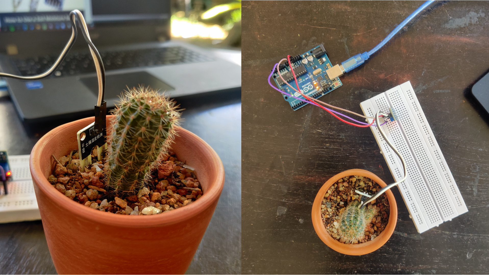

# Soil Moisture Sensor - Arduino

<p align = "center">

</p>

***

For this setup, you will need :
  1. Arduino Uno
  2. Soil moisture Sensor
  
***

The majority of soil moisture sensors are made to calculate the volumetric water content of the soil based on the soil's bulk permittivity (soil dielectric constant). You might think of the dielectric constant as the electrical conductivity of the soil. As the soil's moisture content rises, so does its dielectric constant. This reaction results from the fact that water has a substantially higher dielectric constant than the other soil constituents, including air. As a result, estimating the water content may be done predictably by measuring the dielectric constant.

***
## Steps

  1. Connect the two pins from the Sensor to the two pins on the Amplifier circuit via hook up wires
  2. Connect the Vcc from the Amplifier to the 3.3V pin on the Arduino
  3. Connect the Gnd pin to the Gnd pin on the Arduino
  4. connect the Analog Data Pin to the A0 pin on the Arduino (Analog Input)
 
On arduino `IDLE` run the following Command
```
void setup() {
  // initialize serial communication at 9600 bits per second:
  Serial.begin(9600);
}

// the loop routine runs over and over again forever:
void loop() {
  // read the input on analog pin 0:
  int sensorValue = analogRead(A0);
  // print out the value you read:
  Serial.println(sensorValue);
  delay(1);        // delay in between reads for stability
}
```

## Demo Video

https://user-images.githubusercontent.com/77115237/195062728-eedcda40-591c-40bc-abb6-4c1adfcdf263.mp4


