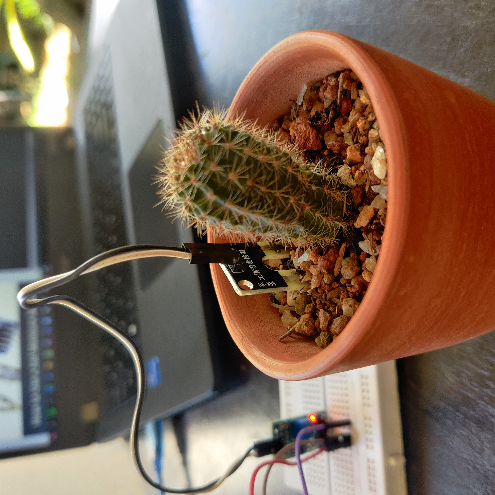

# Soil Moisture Sensor - Arduino

<p align = "center">

</p>

***

For this setup, you will need :
  1. Arduino Uno
  2. Soil moisture Sensor
***

## Connection Digaram

<p align = "center">

</p>

***

Most soil moisture sensors are designed to estimate soil volumetric water content based on the dielectric constant (soil bulk permittivity) of the soil. The dielectric constant can be thought of as the soil's ability to transmit electricity. The dielectric constant of soil increases as the water content of the soil increases. This response is due to the fact that the dielectric constant of water is much larger than the other soil components, including air. Thus, measurement of the dielectric constant gives a predictable estimation of water content.

***
## Steps

  1. Connect the two pins from the Sensor to the two pins on the Amplifier circuit via hook up wires
  2. Connect the Vcc from the Amplifier to the 3.3V pin on the Arduino
  3. Connect the Gnd pin to the Gnd pin on the Arduino
  4. connect the Analog Data Pin to the A0 pin on the Arduino (Analog Input)
 
On arduino `IDLE` run the following Command
```
void setup() {
  // initialize serial communication at 9600 bits per second:
  Serial.begin(9600);
}

// the loop routine runs over and over again forever:
void loop() {
  // read the input on analog pin 0:
  int sensorValue = analogRead(A0);
  // print out the value you read:
  Serial.println(sensorValue);
  delay(1);        // delay in between reads for stability
}
```

## Demo Video

<p align = "center">
<video width="200px" height="auto" controls>
  <source src="../../Asserts/soil_moisture.mp4" type="video/mp4">
</video>
</p>

