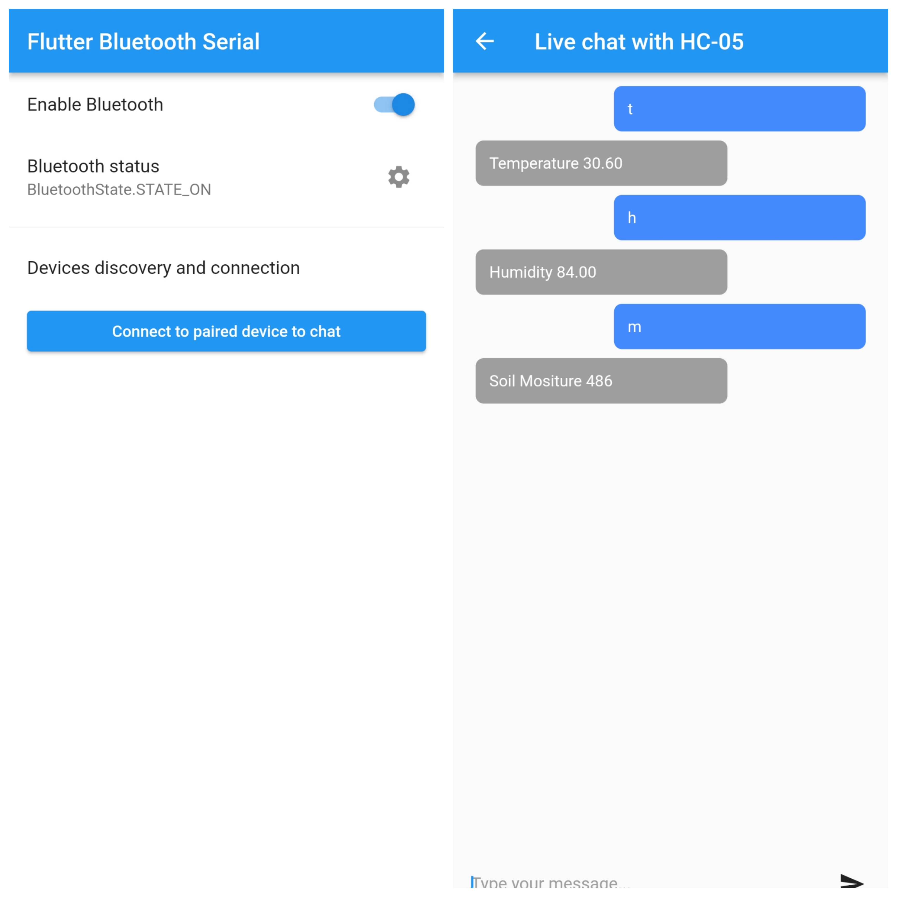
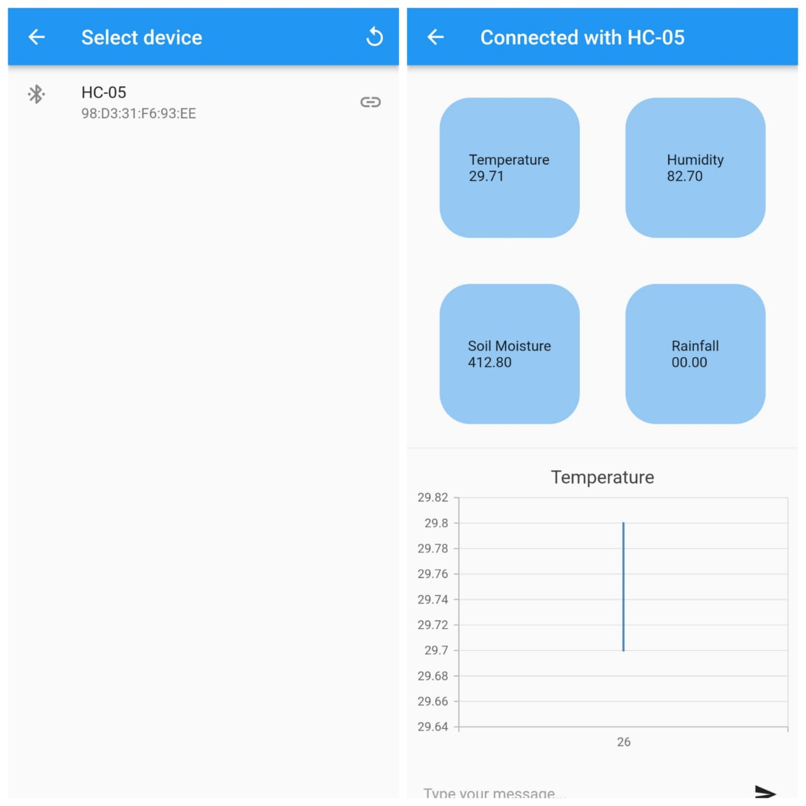
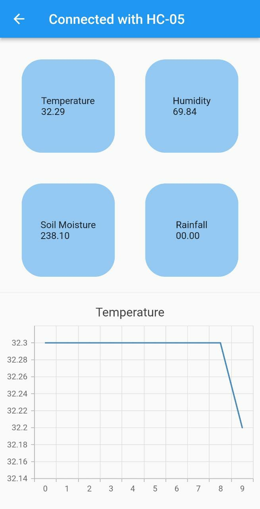

# `Crop Monitoring App`

+ Adapter status monitoring,

+ Turning adapter on and off,

+ Opening settings,

+ Discovering devices (and requesting discoverability),

+ Listing bonded devices and pairing new ones,

+ Connecting to multiple devices at the same time,

+ Sending and recieving data (multiple connections).

The plugin (for now) uses Serial Port profile for moving data over RFCOMM, so make sure there is running Service Discovery Protocol that points to SP/RFCOMM channel of the device.

#### Screens 

Main screen and options | Simple chat with server  

 

## General

The basics are simple, so there is no need to write about it so much.

#### Discovery page

On devices list you can long tap to start pairing process. If device is already paired, you can use long tap to unbond it. 

## Chat example

There is implemented simple chat. Client (the Flutter host) connects to selected from bonded devices server in order to exchange data - asynchronously.

## Real Time visualization

<!--  -->

